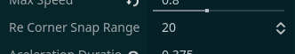

# ReCorner: A Simple Corner Correction In Godot 4.0+

## How To Use??
1. Copy And Paste [ReCorner Function](addons/ReCorner/ReCorner.gd) In Your Code (GDScript Only)  
2. Call The Function Passing Delta `ReCorner(delta)` Just Before `move_and_slide()`  
3. Set In The Inspector The Var `ReCorner_Snap_Range` A Correct Value For Your Game
    >   
4. That’s It! For A Full Example, [See Here](addons/ReCorner/An-Example-Of-Use.gd)  

> [!TIP]
> It's Not Recomender To Call `Recorner(delta)` Only When Not On The Floor, (Example: `if not is_on_floor(): Recorner(delta)`)
> because If The Space Between The Player And The Floor Is Very Small, It Might Not Work Properly And Could End Up Being Uncomfortable For The Player  
>   

> [!WARNING]
> The MIT License Only Applies To The Code In This Repository.  
> The Example Images Shown In the README / In [Multimedia](Multimedia) Are Not Covered By The MIT License  
> Please Do Not Reuse Them In Your Own Projects Unless You Have Permission.  
